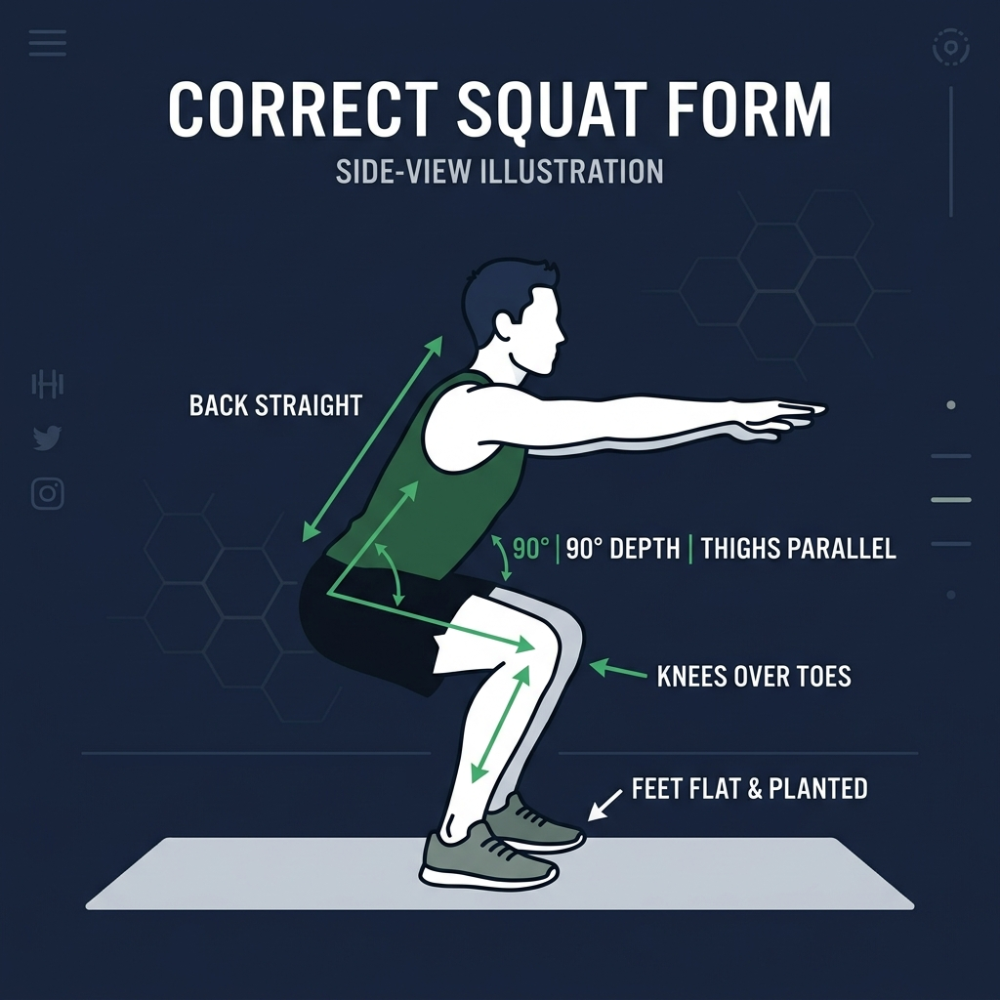

<div align="center">
  
  <h1>GymMentor AI</h1>
  <p><strong>Your Ultimate Computer-Vision Powered Personal Trainer 🏋️‍♂️</strong></p>

  [](https://www.python.org/)
  [](https://streamlit.io/)
  [](https://google.github.io/mediapipe/)
  [](https://opencv.org/)
</div>

<hr/>

## 🚀 Overview

**GymMentor AI** is an advanced, real-time fitness application that uses your webcam to track exercise form, count repetitions, and provide instant voice coaching. Utilizing state-of-the-art **MediaPipe Pose Detection** and a premium **Glassmorphism UI**, the app acts as a digital personal trainer that ensures you exercise safely, efficiently, and consistently.

## ✨ Key Features

- **🎯 Real-Time Posture Tracking:** Accurately tracks Squats, Push-ups, Lunges, Biceps Curls, and Shoulder Presses using joint angle mathematics.
- **🗣️ Dynamic Voice Coaching:** Provides instant audio cues (e.g., "Go deeper", "Keep your back straight") and breathing reminders tailored to your live performance.
- **⚖️ Bi-Lateral Symmetry Detection:** Compares left vs. right joint angles (e.g., left knee vs right knee in lunges) to identify and warn you of muscle imbalances.
- **🛑 Injury Prevention System:** Automatically triggers strict warnings and stops the set if highly dangerous form is detected for 3 consecutive reps.
- **📈 Gamified Progress Analytics:** Tracks daily streaks, total volume, workout consistency, and calculates an **AI Form Score (0-100)** for every session.
- **⏱️ Automated Rest Timers:** Handles sets automatically with configurable countdown rest timers between sets.
- **📅 Workout Scheduler & Programs:** Allows users to build full workout days, schedule routines, and automatically transition between exercises.
- **🔥 Body Metrics & Calorie Estimation:** Computes live BMI and estimates calories burned based on exercise intensity and user profiles.

## 🛠️ Technology Stack

| Component | Technology |
|---|---|
| **Frontend UI** | Streamlit, Native HTML/CSS (3D Grid & Glassmorphism) |
| **Computer Vision** | Google MediaPipe, OpenCV, WebRTC (`streamlit-webrtc`) |
| **Backend & Logic** | Python 3 |
| **Database** | SQLite3 (Persistent tracking & scheduling) |
| **Voice Engine** | `pyttsx3` (Offline Text-to-Speech) |
| **Data Handling** | Pandas, NumPy |

## ⚙️ Installation & Setup

1. **Clone the repository:**
   ```bash
   git clone https://github.com/YOUR_USERNAME/gym-mentor-ai.git
   cd gym-mentor-ai
   ```

2. **Create a virtual environment (Recommended):**
   ```bash
   python -m venv .venv
   # Windows:
   .venv\Scripts\activate
   # macOS/Linux:
   source .venv/bin/activate
   ```

3. **Install the dependencies:**
   ```bash
   pip install -r requirements.txt
   ```

4. **Run the Application:**
   ```bash
   streamlit run main.py
   ```
   *The application will automatically open in your default browser at `http://localhost:8501`.*

## 📁 Project Architecture

```text
GymMentor_AI/
├── core/                   # Base classes for abstract exercise logic
├── detectors/              # Mathematical angle calculations & heuristics per exercise
├── services/
│   ├── auth/               # Login wall & user session management
│   ├── coaching/           # Voice pipeline, LLM integration, Event Bus
│   ├── config/             # Workout programs & goal settings
│   ├── persistence/        # SQLite Database repository
│   ├── scheduling/         # Cron logic & BMI tracking
│   ├── tracking/           # Metrics, Calorie Estimator, Progress Analytics
│   ├── ui/                 # CSS styling loaders
│   └── vision/             # WebRTC Video Processor threading & OpenCV drawing
├── static/                 # CSS assets, fonts, and exercise demo GIFs/PNGs
└── main.py                 # Streamlit application entry point & routing
```

## 🤝 Contributing
Contributions, issues, and feature requests are welcome! Feel free to check the issues page.

## 📜 License
This project is licensed under the MIT License.

<div align="center">
  <i>Built with ❤️ to revolutionize home workouts.</i>
</div>
