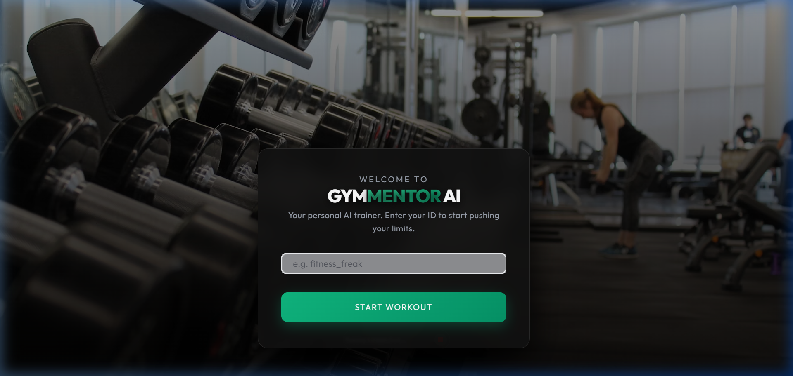
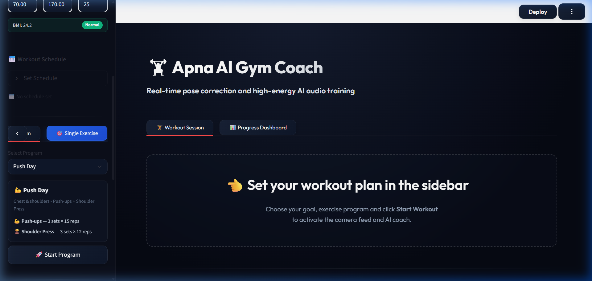
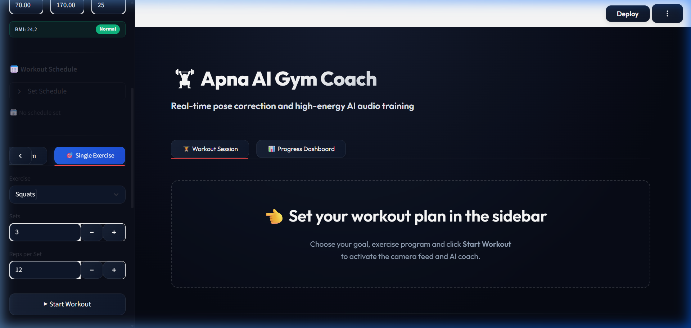
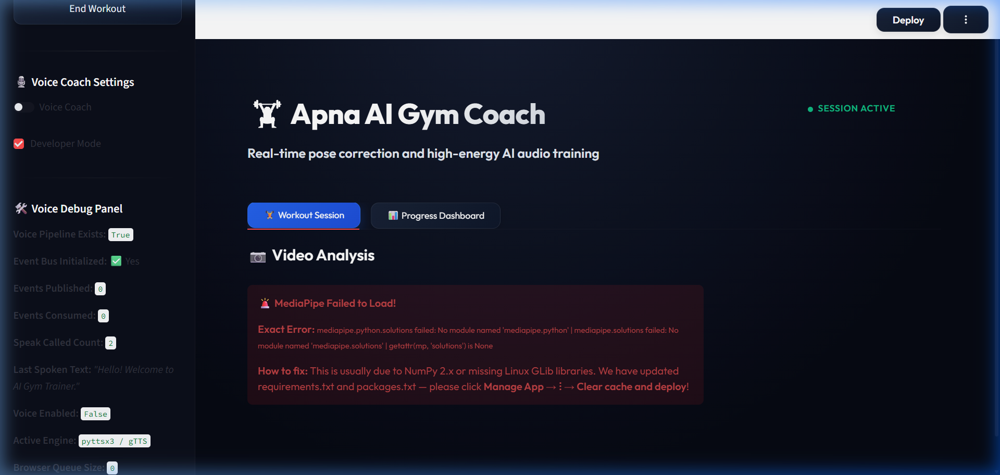
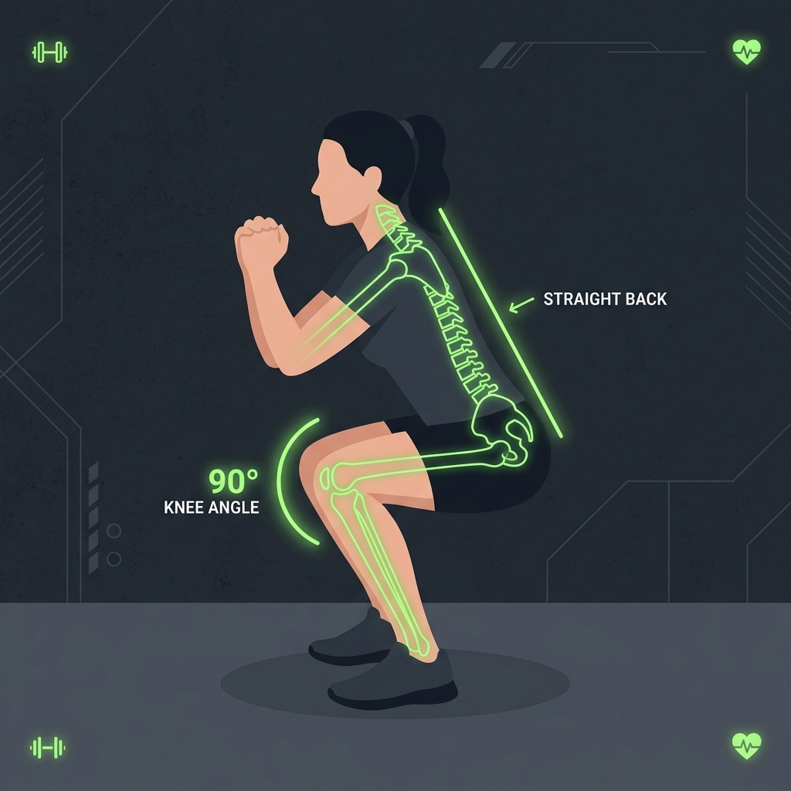
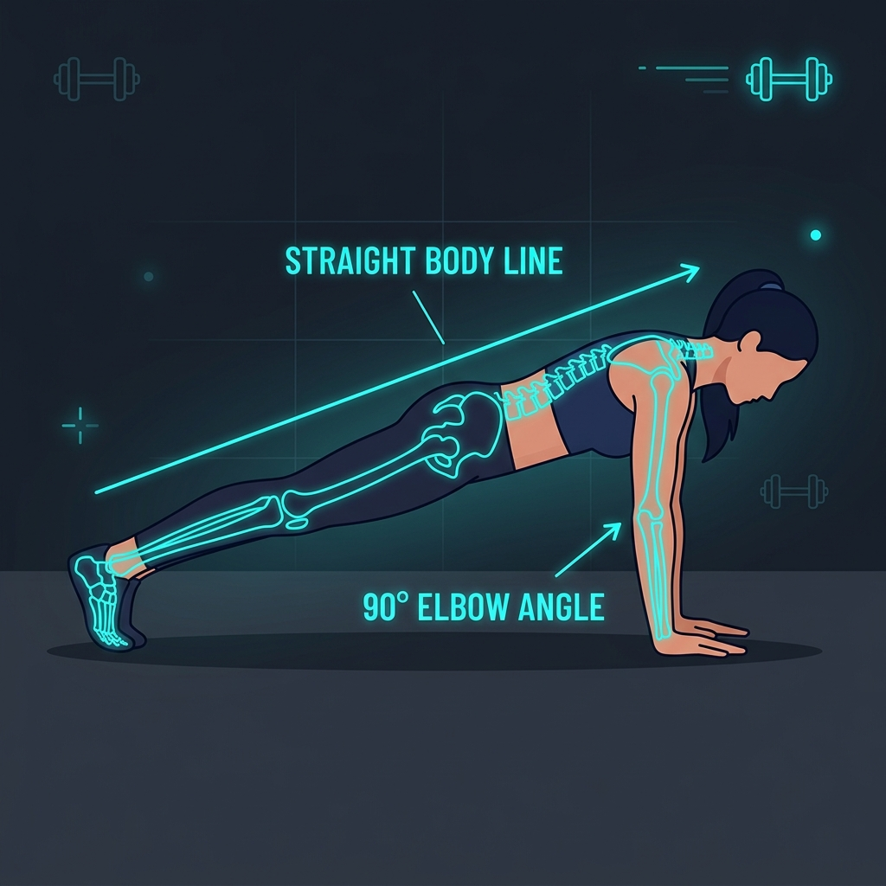
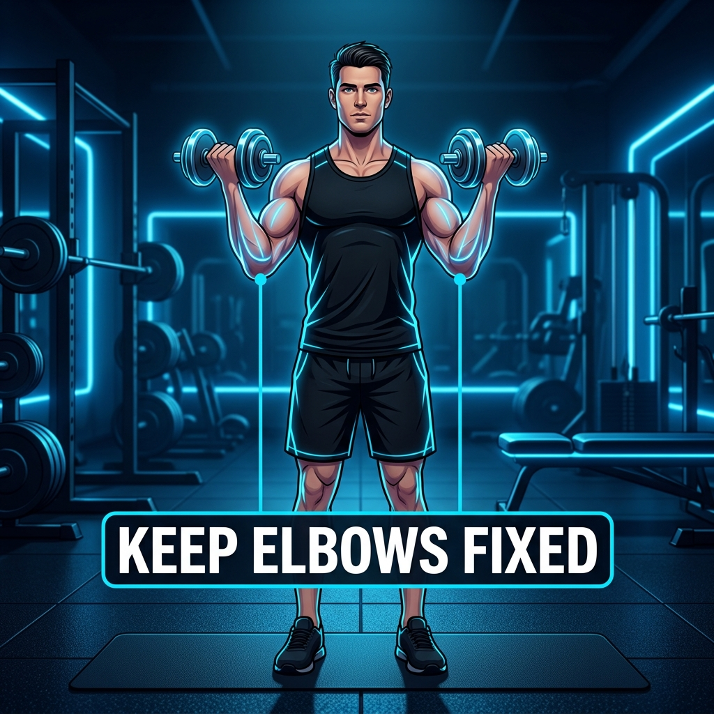
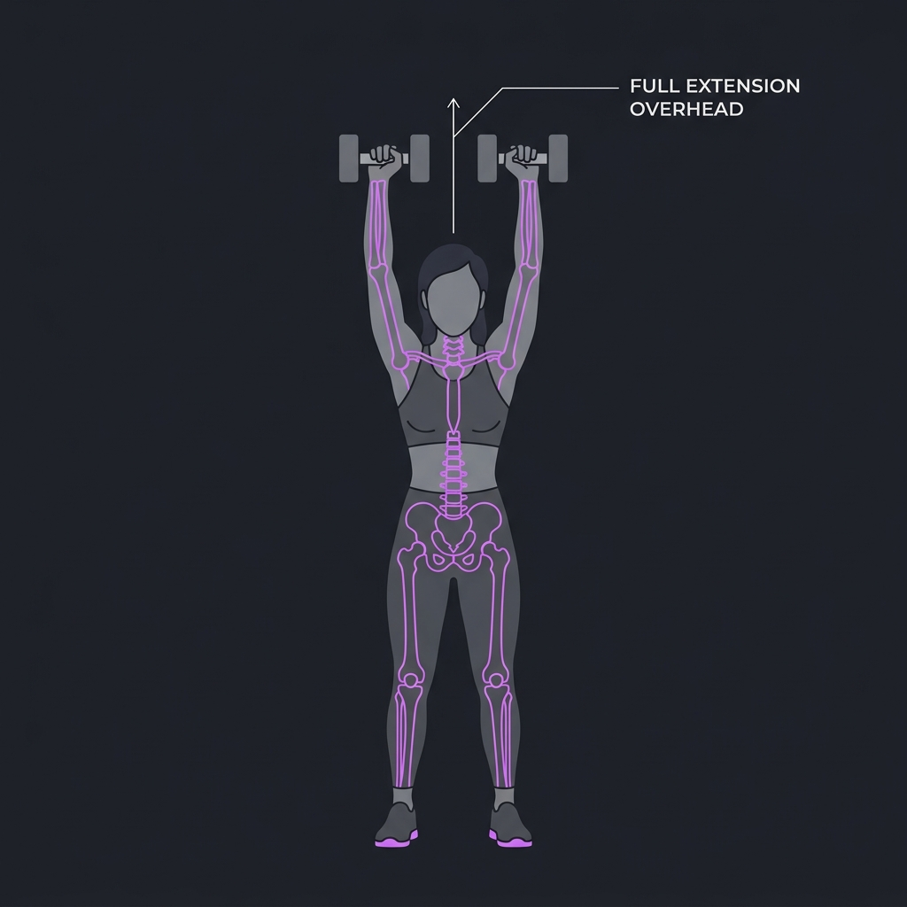
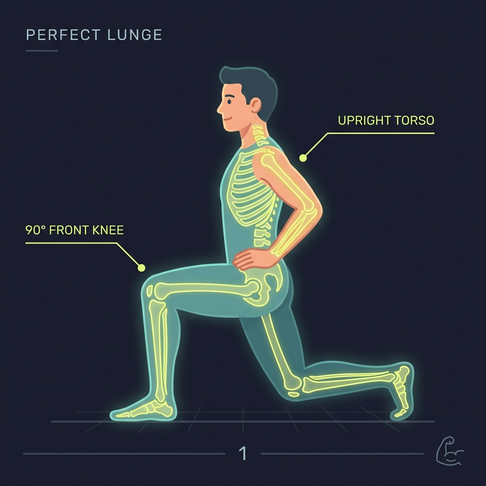

# 🏋️‍♂️ GymMentor AI — Real-Time AI Fitness Coach & Biomechanical Form Analyzer

<div align="center">


<br/>

**Transform your computer webcam into an elite personal trainer powered by 3D Computer Vision, Biomechanical Vector Mathematics, and Llama 3 Voice Coaching.**

[Get Started Locally](#-step-by-step-installation--setup) • [Report Bug](https://github.com/soham-1801/gym-mentor-ai/issues) • [Request Feature](https://github.com/soham-1801/gym-mentor-ai/issues)

</div>

---

## 📑 Table of Contents
- [🌟 Executive Summary & Overview](#-executive-summary--overview)
- [✨ Core Capabilities & Feature Highlights](#-core-capabilities--feature-highlights)
- [🖥️ Interactive Application Feature Gallery](#-interactive-application-feature-gallery)
- [🎯 Visual Exercise Showcase](#-visual-exercise-showcase)
- [🧠 Biomechanical Evaluation Table](#-biomechanical-evaluation-table)
- [🔄 AI & Computer Vision Processing Pipeline](#-ai--computer-vision-processing-pipeline)
- [🏗️ System Architecture & Project Tree](#-system-architecture--project-tree)
- [🛠️ Technology Stack](#-technology-stack)
- [⚙️ Step-by-Step Installation & Setup](#-step-by-step-installation--setup)
- [🛡️ Best Practices & Form Guidelines](#-best-practices--form-guidelines)
- [🤝 Contributing & License](#-contributing--license)

---

## 🌟 Executive Summary & Overview

**GymMentor AI** is an enterprise-grade, real-time AI workout assistant designed to democratize professional personal fitness training right on your computer. Traditional fitness apps rely on manual logging and passive video tutorials, leaving athletes vulnerable to incorrect posture, suboptimal muscle engagement, and acute gym injuries.

By integrating **Google MediaPipe's 3D Pose Estimation** with custom **vector trigonometry algorithms** and **Groq's ultra-fast Llama 3 LLM**, GymMentor AI performs real-time biomechanical analysis directly via your local webcam at 30+ frames per second. It tracks joint articulation, computes bilateral muscle symmetry, logs reps and sets, estimates MET-based calorie burn, and delivers instant, human-like verbal coaching cues to fix your form on the fly.

---

## ✨ Core Capabilities & Feature Highlights

### 🦾 1. Real-Time 3D Biomechanical Tracking
- **33 Landmark Spatial Mesh**: Continuously tracks key spatial coordinates (shoulders, elbows, wrists, hips, knees, ankles) in 3D space in real time.
- **Trigonometric Joint Angle Calculation**: Uses vector dot product mathematics to calculate precise internal joint angles with sub-degree accuracy.
- **Dynamic Repetition State Machine**: Employs robust state-transition logic (`IDLE` ➔ `DOWN` ➔ `UP` ➔ `REP_COMPLETE`) to eliminate false positive rep counts from camera jitter.

### 🗣️ 2. Live AI Voice Coach (Groq Llama 3 + Web Speech API)
- **Zero-Latency Verbal Feedback**: Instantly analyzes workout flaws and triggers personalized audio coaching cues (*"Squat lower to break parallel!"*, *"Keep your back straight!"*, *"Excellent rep speed!"*).
- **Post-Workout LLM Summary**: Generates comprehensive AI coaching summaries after each session, highlighting best form scores, weakest joint angles, and personalized recovery tips.
- **Audio Hash Caching**: Smart audio caching prevents playback loops or browser stuttering during intensive video rendering.

### ⚖️ 3. Bi-Lateral Symmetry & Injury Prevention
- **Imbalance Warning System**: Continuously monitors left-to-right body symmetry during exercises like Shoulder Presses and Lunges.
- **Real-Time Visual Alerts**: Displays immediate warning banners and form score deductions if one arm or leg lags behind, preventing muscular imbalances and joint strain.

### 📊 4. Advanced Fitness Metrics & MET Calorie Engine
- **Active MET Calorie Tracking**: Computes real-time energy expenditure using scientifically validated Metabolic Equivalent of Task (MET) formulas based on exercise intensity, body weight, and duration.
- **Form Quality Scoring**: Assigns a real-time percentage grade (0–100%) to every single repetition based on depth, alignment, and tempo.
- **Interactive Progress Dashboard**: Visualizes workout history, total volume lifted, streak calendars, and personal records.

### 🎨 5. Glassmorphism UI & High-Performance WebRTC Streaming
- **Sleek Dark Mode Aesthetics**: Engineered with curated HSL color palettes, custom typography (`AdobeClean`), and responsive CSS glassmorphic cards.
- **Local WebRTC Video Pipeline**: High-speed local webcam capture and canvas rendering without sending any video data to external servers.

---

## 🖥️ Interactive Application Feature Gallery

Explore the rich glassmorphic interface and professional features of **GymMentor AI**:

<div align="center">

| 🔐 1. Personalized Goal & Profile Setup | 📋 2. Smart Workout Program Scheduler |
| :---: | :---: |
|  |  |
| **Custom Fitness Goals, Experience Levels & Daily Calorie Targets** | **Multi-Week Structured Training Plans (Hypertrophy, Strength & Endurance)** |

| 🏋️‍♂️ 3. Custom Single Exercise Selector | 🤖 4. Live 3D Vision AI Trainer Studio |
| :---: | :---: |
|  |  |
| **Interactive Catalog with Configurable Target Reps, Sets & Rest Timers** | **Real-Time Landmark Tracking, Audio Coaching, MET Calories & Form Scores** |

</div>

---

## 🎯 Visual Exercise Showcase

<div align="center">

| 🏋️‍♂️ Squats Analysis | 🤸‍♂️ Push-ups Tracking | 💪 Biceps Curls Form |
| :---: | :---: | :---: |
|  |  |  |
| **Knee Flexion & Hip Hinge Depth** | **Elbow Extension & Back Line** | **Range of Motion & Shoulder Lock** |

| 🏋️‍♀️ Shoulder Press Symmetry | 🦵 Lunges Leg Angle | 📈 Real-Time AI Metrics |
| :---: | :---: | :---: |
|  |  |  |
| **Bi-Lateral Arm Extension** | **90° Front & Back Knee Hinge** | **Rep Counting, Form Score & Calorie Burn** |

</div>

---

## 🧠 Biomechanical Evaluation Table

GymMentor AI enforces strict biomechanical standards across all supported movements:

| Exercise Name | Primary Muscles Trained | Tracked Joint Angles | Form Quality Thresholds | Common Faults & AI Corrections |
| :--- | :--- | :--- | :--- | :--- |
| **Squats** | Quadriceps, Glutes, Hamstrings | Knee Angle, Hip Hinge, Back Line | Knee $\le 90^\circ$ (Parallel Depth) | Shallow depth, forward torso lean, knee valgus collapse |
| **Push-ups** | Pectoralis Major, Deltoids, Triceps | Elbow Angle, Body Line Alignment | Elbow $\le 85^\circ$ at bottom | Sagging hips, arched lower back, incomplete extension |
| **Biceps Curls** | Biceps Brachii, Brachialis, Forearms | Elbow Flexion, Shoulder Swing | Ext $> 150^\circ$, Flex $< 40^\circ$ | Elbow flaring, using momentum / swinging torso |
| **Shoulder Press** | Anterior Deltoids, Triceps, Traps | Shoulder Elevation, Elbow Lock | Full vertical lock ($165^\circ+$) | Asymmetrical pressing (Left/Right imbalance), arching spine |
| **Lunges** | Quadriceps, Glutes, Calves | Front Knee Flexion, Rear Hinge | Front Knee $\approx 90^\circ$ | Front knee overstepping toes, losing lateral balance |

---

## 🔄 AI & Computer Vision Processing Pipeline

The system operates on a high-throughput, asynchronous real-time processing loop running directly on your local system:

```text
+-----------------------+     +------------------------+     +-------------------------+
|   Webcam Video Stream | --> |   Streamlit WebRTC     | --> |  Google MediaPipe Pose  |
|  (30+ FPS Local Feed) |     |  (Local Video Canvas)  |     |  (33 3D Spatial Nodes)  |
+-----------------------+     +------------------------+     +-------------------------+
                                                                          |
                                                                          v
+-----------------------+     +------------------------+     +-------------------------+
| Live Audio/Visual UI  | <-- | Groq Llama 3 Coach     | <-- | Exercise Detector Core  |
| (TTS Speech & Alerts) |     | (Personalized Advice)  |     | (Vector Trigonometry)   |
+-----------------------+     +------------------------+     +-------------------------+
            |
            v
+-----------------------+     +------------------------+
| Real-Time Dashboard   | --> | SQLite Persistence     |
| (MET Calories & Score)|     | (Workout History DB)   |
+-----------------------+     +------------------------+
```

1. **Video Capture**: Frames are captured via browser WebRTC and processed locally without storing video on disk.
2. **Pose Estimation**: Google MediaPipe extracts X, Y, and Z coordinates for 33 anatomical landmarks.
3. **Vector Trigonometry**: Exercise detectors compute Euclidean vectors and interior angles between connected joint segments.
4. **State Machine & Scoring**: Repetitions are logged when angle thresholds transition cleanly; real-time form percentage is calculated.
5. **AI Coach Intervention**: If consecutive reps exhibit poor form (e.g., shallow squats), the event bus triggers Groq Llama 3 to synthesize corrective coaching speech.

---

## 🏗️ System Architecture & Project Tree

```text
gym-mentor-ai/
│
├── core/                        # Core exercise interfaces & data structures
│   ├── __init__.py
│   └── base_exercise.py         # Abstract Base Class for all exercise detectors
│
├── detectors/                   # Biomechanical exercise detectors & angle math
│   ├── __init__.py
│   ├── biceps_curl.py           # Biceps curl range-of-motion detector
│   ├── lunges.py                # Front/rear leg lunge balance detector
│   ├── pushups.py               # Push-up depth & back alignment detector
│   ├── shoulder_press.py        # Overhead press symmetry detector
│   └── squat.py                 # Squat parallel depth & posture detector
│
├── services/                    # Core business logic & backend pipelines
│   ├── auth/                    # User authentication & session gating
│   │   └── login_wall.py
│   ├── coaching/                # LLM coaching engine, TTS & event bus
│   │   ├── event_bus.py         # Asynchronous coaching event dispatcher
│   │   ├── feedback_manager.py  # Post-workout feedback & score synthesizer
│   │   ├── form_analyzer.py     # Real-time form rule evaluator
│   │   ├── llm.py               # Groq API Llama 3 client wrapper
│   │   ├── tts.py               # Text-to-Speech audio synthesizer
│   │   └── voice_pipeline.py    # Unified speech feedback pipeline
│   ├── config/                  # Configuration & workout program definitions
│   │   ├── goal_config.py       # Fitness goals (Hypertrophy, Strength, etc.)
│   │   ├── workout_config.py    # Exercise catalog & default properties
│   │   └── workout_program.py   # Preset multi-week training programs
│   ├── persistence/             # Database repository & storage layer
│   │   └── exercise_repository.py # SQLite database CRUD operations
│   ├── scheduling/              # Smart workout planner & notifications
│   │   └── workout_scheduler.py # Calendar scheduling & BMI calculator
│   ├── state/                   # Streamlit session state management
│   │   └── session_defaults.py  # State initialization & reset logic
│   ├── tracking/                # Metrics, analytics & calorie engines
│   │   ├── calorie_estimator.py # MET-based active calorie burn formulas
│   │   ├── metrics.py           # Real-time UI metric synchronizer
│   │   └── progress_analytics.py # Charts, graphs & streak calculations
│   ├── ui/                      # Styling, fonts & custom web components
│   │   └── style_loader.py      # CSS loader & font face injector
│   ├── vision/                  # Video processing & MediaPipe integration
│   │   └── exercise_video_processor.py # WebRTC video frame analyzer
│   └── webrtc_patch.py          # Custom iframe CSS styling patcher
│
├── static/                      # Static assets, styling & demo graphics
│   ├── AdobeClean.otf           # Typography font asset
│   ├── style.css                # Glassmorphic CSS design system
│   └── demos/                   # Correct form exercise demonstration images
│       ├── bicep_curl.png
│       ├── lunge.png
│       ├── pushup.png
│       ├── shoulder_press.png
│       └── squat.png
│
├── main.py                      # Main Streamlit application entry point
└── requirements.txt             # Python package dependencies
```

---

## 🛠️ Technology Stack

| Category | Technology / Library | Purpose in GymMentor AI |
| :--- | :--- | :--- |
| **Frontend Web App** | `Streamlit 1.54.0` | Reactive web interface, session state, routing, and UI rendering |
| **Computer Vision** | `MediaPipe 0.10.14` | High-speed 3D human pose landmark detection (33 body points) |
| **Image Processing** | `OpenCV (cv2) 4.10.0` | Frame manipulation, color space conversion, and visual text overlays |
| **Real-Time Streaming**| `streamlit-webrtc`, `aiortc`, `av`| Low-latency browser webcam video streaming over WebRTC protocols |
| **Artificial Intelligence**| `Groq API`, `Llama 3 8B/70B` | Instant synthesized fitness coaching, personalized tips, and summaries |
| **Data & Analytics** | `Pandas`, `NumPy` | Data wrangling, metric aggregations, and mathematical vector calculations |
| **Database** | `SQLite3` | Lightweight, embedded persistent storage for user profiles and history |
| **Design & Styling** | `Vanilla CSS3`, `HTML5` | Glassmorphic UI cards, dynamic gradients, and custom font injection |

---

## ⚙️ Step-by-Step Installation & Setup

### Prerequisites
- **Python 3.9 to 3.11** installed on your system.
- A functional **webcam** (built-in laptop camera or external USB webcam).
- A free **Groq API Key** (Get one at [console.groq.com](https://console.groq.com/)).

### 1. Clone the Repository
```bash
git clone https://github.com/soham-1801/gym-mentor-ai.git
cd gym-mentor-ai
```

### 2. Set Up Python Virtual Environment
It is recommended to use a virtual environment to prevent dependency conflicts:

```bash
# For Windows (PowerShell / CMD)
python -m venv .venv
.venv\Scripts\activate

# For macOS / Linux
python3 -m venv .venv
source .venv/bin/activate
```

### 3. Install Python Dependencies
```bash
pip install --upgrade pip
pip install -r requirements.txt
```

### 4. Configure API Secrets
Create a `.streamlit` directory and a `secrets.toml` file inside it to securely store your Groq API key:

```bash
# Create directory and file (macOS/Linux)
mkdir -p .streamlit
touch .streamlit/secrets.toml

# For Windows PowerShell
New-Item -ItemType Directory -Force -Path .streamlit
New-Item -ItemType File -Force -Path .streamlit\secrets.toml
```

Open `.streamlit/secrets.toml` in your code editor and add your API key:
```toml
# .streamlit/secrets.toml
GROQ_API_KEY = "gsk_your_actual_groq_api_key_here"
```

### 5. Launch GymMentor AI Locally
```bash
streamlit run main.py
```
Your default web browser will automatically open at `http://localhost:8501`.

---

## 🛡️ Best Practices & Form Guidelines

To achieve maximum tracking accuracy and optimal AI coaching results, follow these physical training setup rules:

```text
       [  WEBCAM  ]
           || (6 to 8 Feet Distance)
           ||
       +--------+
       |        |  <--- Keep full body visible from head to toe
       |  USER  |  <--- Wear contrasting workout clothes against background
       |        |  <--- Ensure bright front-facing room lighting
       +--------+
```

1. **Optimal Lighting**: Position a bright light source in front of you. Avoid strong backlighting (like standing directly in front of a sunny window), which darkens your silhouette and reduces pose detection accuracy.
2. **Camera Positioning**: Place your device camera at waist-to-chest height, approximately **6 to 8 feet away**. Ensure your entire body (from head to feet) remains visible inside the frame throughout the full range of motion.
3. **Clothing Contrast**: Wear workout attire that contrasts clearly against your room background to help MediaPipe's neural networks distinguish joint boundaries easily.
4. **Audio Enable**: Turn on device speakers or Bluetooth earbuds to receive real-time verbal form corrections without needing to look at the screen during heavy lifts.

---

## 🤝 Contributing & License

We welcome contributions from fitness enthusiasts, developers, and computer vision researchers! 

### How to Contribute
1. **Fork** the repository on GitHub.
2. Create a new feature branch (`git checkout -b feature/AmazingNewExercise`).
3. Commit your changes with clear messages (`git commit -m 'feat: add Planks core form detector'`).
4. Push your branch (`git push origin feature/AmazingNewExercise`).
5. Open a **Pull Request** for review!

### License
This software is open-sourced under the terms of the **MIT License**. See the [LICENSE](file:///c:/Users/SOHAM%20MANGROLIYA/OneDrive/Desktop/Real-Time%20AI%20Gym%20Trainer/LICENSE) file for complete legal details.

---

<div align="center">

**Built with ❤️ and ☕ by [Soham Mangroliya](https://github.com/soham-1801) & Contributors.**

*Empowering healthier lives through Artificial Intelligence and Biomechanics.*

⭐ **If you find GymMentor AI useful, please consider giving this repository a star on GitHub!** ⭐

</div>
